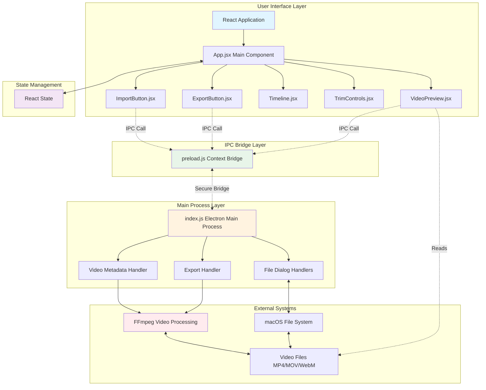
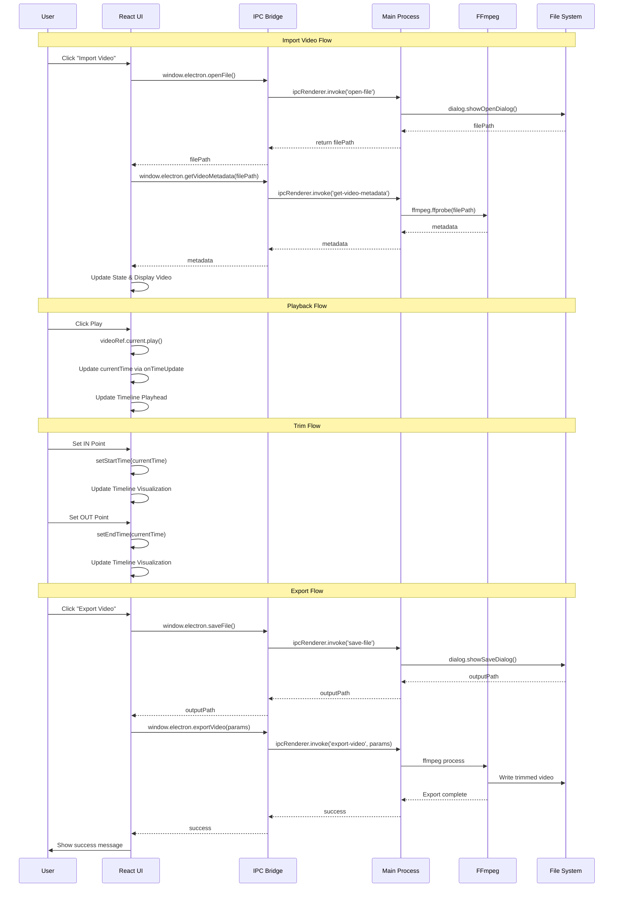
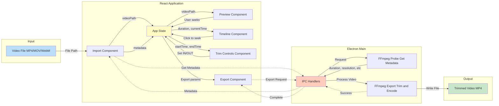
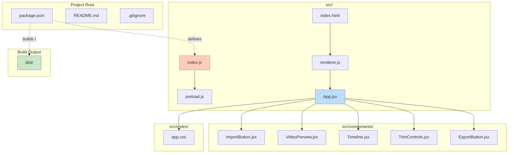
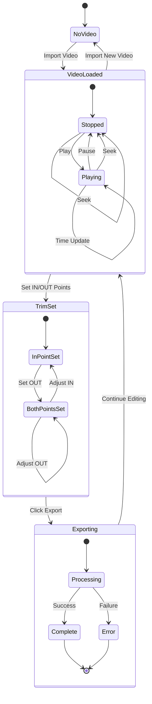
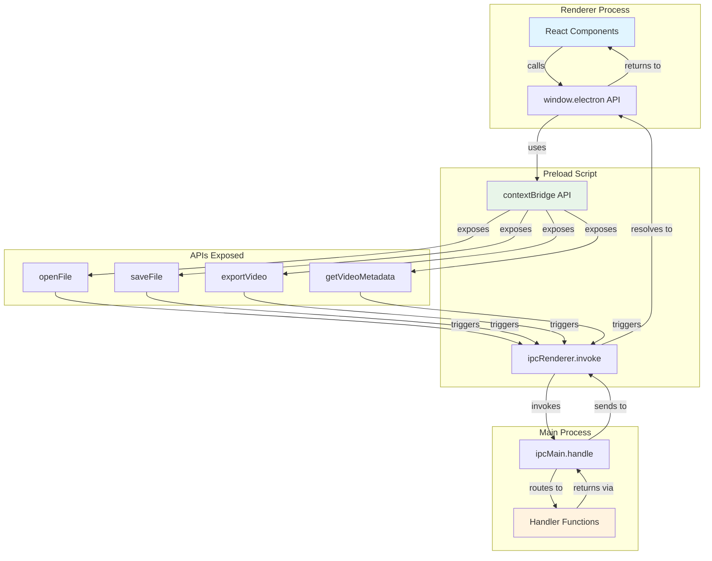
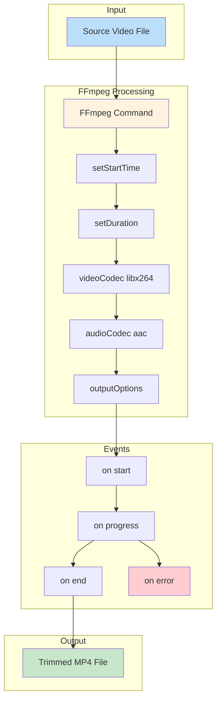
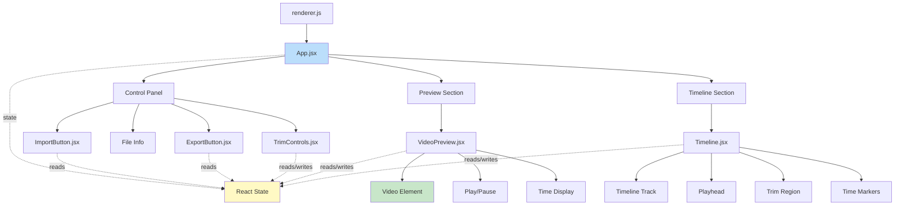
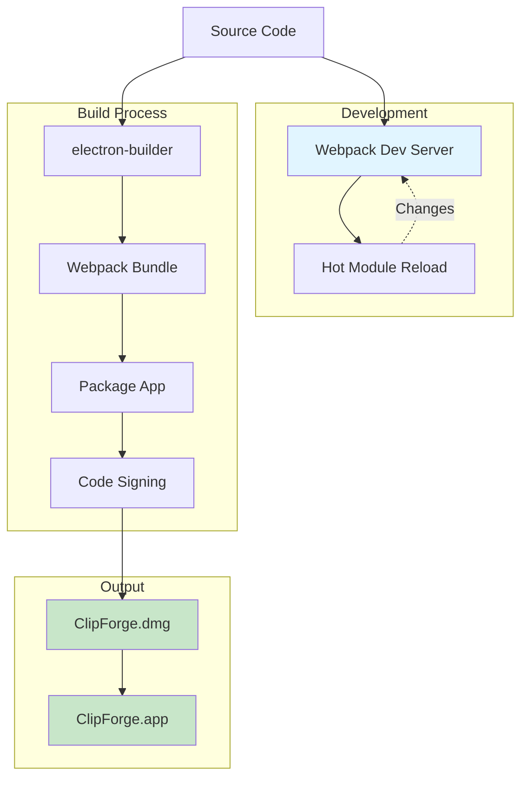
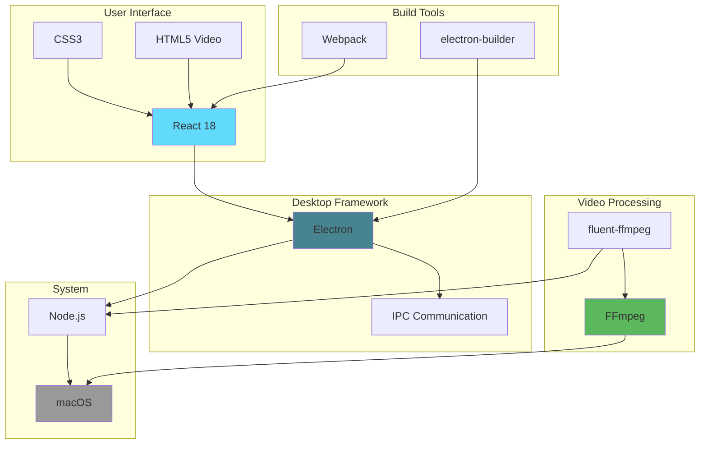

# ClipForge Architecture Diagrams

## System Architecture



## Component Interaction Flow



## Data Flow



## File Structure



## State Management



## IPC Communication



## FFmpeg Processing Pipeline



## Component Hierarchy



## Security Model

```mermaid
graph LR
    subgraph "Renderer"
        React[React App]
    end

    subgraph "Preload"
        Bridge[contextBridge]
    end

    subgraph "Main"
        Main[Node.js APIs]
    end

    React -->|Limited API| Bridge
    Bridge -->|Secure IPC| Main
    React -.X Blocked.-> Main
    
    Note1[nodeIntegration false]
    Note2[contextIsolation true]
    Note3[enableRemoteModule false]
    
    Note1 -.-> React
    Note2 -.-> Bridge
    Note3 -.-> Main

    style React fill:#ffcdd2
    style Bridge fill:#c8e6c9
    style Main fill:#fff9c4
```

## Build and Distribution



## Technology Stack


